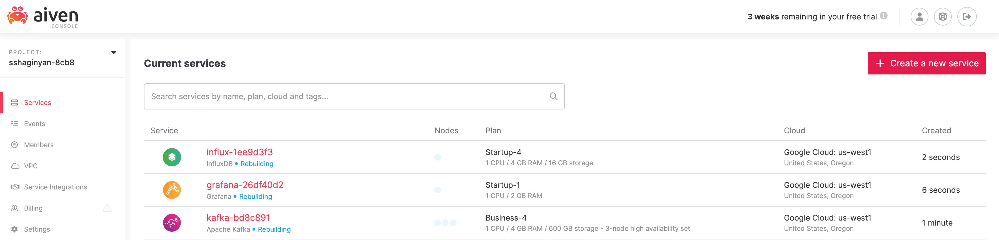
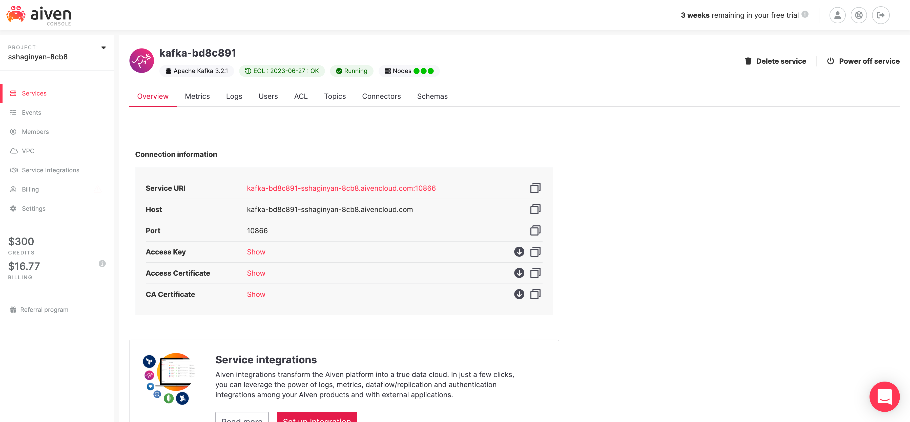

# Aiven Kafka Quickstart with NodeJS

Over the past year, our adoption rates for Kafka, InfluxDB, and Grafana have skyrocketed. Our customers want to take advantage of Kafka's blazing fast performance while observing and visualizing every CPU tick, network spike, and IOPS burst through Grafana. In today's 15 minute tutorial, we'll be generating and publishing fake financial transaction data into Kafka. Then we'll use Aiven's point and click service integrations to collect logs/metrics into InfluxDB. Finally, we'll use Grafana to visualize logs/metrics stored in InfluxDB.


How is it possible to do so much within 15 minutes one might ask? Well, Aiven provides us with a self-service platform for `ing fully managed data technologies through a few clicks of the mouse. Instead of spending countless weeks operationalizing highly complex services, you can set up and tear down data services within minutes. Not only do you save on staff time for database deployments and maintenance, but you save dinero on operational expenses and break even within five months on average.

Let's get the ball rolling!

## Signup with Aiven
First things first, [signup](https://console.aiven.io/signup/email) with Aiven and get a free 30 day trial.


## Provisioning Apache Kafka, InfluxDB, and Grafana

[Login](https://console.aiven.io/login) to Aiven's console where you'll land on the `/services` page. The `/services` page lists all services provisioned for your account. If this is your first time logging in, there should be no services provisioned at this time. Your screen should look like the one below.


Next, we'll provision a Kafka cluster. Click on the red button  to provision a new service. You'll be directed to the `/new-service` provisioning page shown below.


Now there is a lot happening on page! It seems overwhelming at first, but I promise it's not as complex as it seems. What Aiven's UX teams have done here is actually quite ingenious. They've clumped together complex configuration options without losing any service capabilities and provided us with merely the essentials.

- **service** e.g. Apache Kafka
- **cloud provider** e.g. Google Cloud
- **region and zone** e.g. google-us-east1
- **tier and plan** e.g. Business-4
- **service name** e.g. kafka-3d339efc
- other options that are specific to a service

Easy peasy!

Notice all services (Apache Kafka, InfluxDB, Grafana) that we'll use for this tutorial are listed on this page with Apache Kafka selected by default. Leave all configurations as they are and click on . You'll be directed back to the `/services` page where a Kafka cluster will start provisioning and your screen will look like so.


Provisioning services can take a while, therefore to paralleize efforts in the interest of time, provision Grafana and InfluxDB next in the same manner as we did Apache Kafka. Remember, don't change any configuration options for InfluxDB nor Grafana, the default configurations will be adequate for this tutorial.

Once the provisioning for these services start, you'll notice a status message next to the service name. E.g. "InfluxDB • Rebuilding"



After provisioning completes, the status for these services will change from "Rebuilding" in blue to "Running" in green. E.g. "InfluxDB • Running"


## Publishing Messages Into Kafka

In the previous section we successfully provisioned three services: Apache Kafka, InfluxDB, and Grafana in a matter of minutes. In this section we'll be creating a Kafka topic (log of events) to hold our fake financial transaction data using Aiven's easy to use console. Next, we'll create a Kafka producer using NodeJS + KafkaJS and publish messages into our topic. Finally, we'll enable Aiven's implementation of Kafka REST called Karaspace through a flip of a switch and start consuming messages within Aiven's console.

Let's get started!

We'll first enable Apache Kafka's REST APIs. From the `/services` page, click on your provisioned Apache Kafka service directing you to your particular Kafka cluster's `/overview` page.



There is a lot to unpack on this page, so take some time to familiarize yourself with the tabs above.

Make sure you're on the `/overview` page and scroll down a bit untill the **Apache Kafka REST API (Karapace)** section is visable. Flip on the switch next to it.


The purpose of enabling the **Apache Kafka REST APIs** is so that we can later consume and spot check messages from Kafka using Avien's console instead of creating a Kafka consumer from scratch. Aiven provides us with shortcuts whenever possible.

Next, let's create a brand new Kafka topic called "transactions". Navigate to the "Topics" tab and type "transactions" in the input text field under label "Topic name". Click on .


A Kafka topic is similar to a folder in a filesystem, and our Kafka messages are the files in that folder. We just created a "folder" called transactions which we'll populate with "files" that hold individual financial transactions.

Next, le'ts create a Kafka producer in NodeJS with client library KafkaJS. I was on the fence when deciding what language to use for my Kafka producer. It was either going to be Python, JavaScript via NodeJS, or Scala (since Kafka is written in Scala). I decided to use JavaScript via NodeJS to reach a broader audience according to [StackOverflows 2022 Survey](https://survey.stackoverflow.co/2022/#most-popular-technologies-language). JavaScript is still significantly popular than Python or Scala.

We'll be using three npm packages.

* kafkajs - a modern Kafka client for NodeJS.
* @faker-js/faker - generates category specific fake data, e.g. Finance.
* dotenv - loads environment variables from a `.env` file into [`process.env`](https://nodejs.org/docs/latest/api/process.html#process_process_env).

We'll start off by authenticating with our Kafka cluster. The default authentication method provided by our Kafka cluster is Transport Layer Security which relies on certification-based security.

 Visit the `/overview` page for our Kafka service to find and copy fields **Service URI**, **Access Key**, **Access Certificate**, and **CA Certificate** into a `.env` file.


Use my `.env` template to fill in these values. Notice, the first two environment variables are already assigned and should not be changed. 

```bash
TOPIC="transactions"
KAFKAJS_NO_PARTITIONER_WARNING=1
SERVICE_URI=""
ACCESS_KEY=""
ACCESS_CERTIFICATE=""
CA_CERTIFICATE=""
```

Create a new file called `producer.js` at the same directory level as our `.env` file and populate it with the code below.

```javascript
// We are importing our three npm packages
import { Kafka } from 'kafkajs';
import * as dotenv from 'dotenv';
import { faker } from '@faker-js/faker';

// Loads environment variables from .env file into process.env
dotenv.config();

// Creates an authenticated Kafka client
const kafka = new Kafka({
	brokers: [process.env.SERVICE_URI],
  ssl: {
		ca: [process.env.CA_CERTIFICATE],
		key: process.env.ACCESS_KEY,
		cert: process.env.ACCESS_CERTIFICATE
  }
});

// Creates and connects a producer to our Kafka cluster
const producer = kafka.producer();
await producer.connect();

// Creates a continous stream of generated data
while(true) {
	const messages = [];
  // Creates up to 500 batched financial transactions at a given time
  for(let index = 0; index < Math.floor(Math.random() * 500) + 1; index++) {
		// Populates array `messages` with fake data using faker
		messages.push({
	  	key: `"${faker.datatype.uuid()}"`,
	    value: JSON.stringify({
				timestamp: faker.date.recent(),
				account: faker.finance.account(),
				accountName: faker.finance.accountName(),
				currency: faker.finance.currencyCode(),
				card: faker.finance.creditCardIssuer(),
				amount: faker.finance.amount()
			})
		});
  }
  // Publishes messages to Kafka on a particular topic
  await producer.send({ topic: process.env.TOPIC, messages });
}

// Catches any uncaught exceptions and disconnect our producer
process.on('uncaughtException', async error => {
	console.error(error, 'Uncaught Exception thrown');
  await producer.disconnect();
  process.exit(1);
});
```

Make sure you go through the code and read the comments thoroughly. Also if you just want to clone this project you can do so from 


Dependabot


We also want to enable some ES6 capabilities. We want to be able to use the `import...from` syntax as well as enable top-level await. To do this, open `package.json` with a text editor and add property "type" with value "module".

Here is what the contents of your `package.json` file should look like.

```json
{
  "dependencies": {
		"@faker-js/faker": "^7.5.0",
		"dotenv": "^16.0.2",
		"kafkajs": "^2.2.0"
  },
  "type": "module"
}
```

 

