# Aiven Kafka Quickstart with NodeJS

Over the past year, our adoption rates for [Kafka](https://docs.aiven.io/docs/products/kafka.html), [InfluxDB](https://aiven.io/influxdb), and [Grafana](https://docs.aiven.io/docs/products/grafana.html) have skyrocketed. Our customers want to take advantage of Kafka's blazing fast performance while observing and visualizing every CPU tick, network spike, and IOPS burst through Grafana. In today's short tutorial, we'll be publishing manufactured financial transaction data into Kafka. Then we'll use Aiven's point and click [service integrations](https://help.aiven.io/en/articles/1456441-getting-started-with-service-integrations) to store some Kafka metrics into InfluxDB. Finally, we'll use Grafana to visualize those metrics.

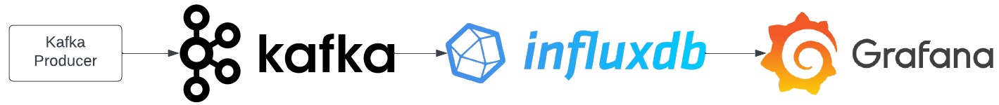

How is it possible to do so much within so little time one might ask? Well, Aiven provides us with a self-service platform for provisioning fully managed data technologies through a few clicks of the mouse. Instead of spending countless weeks operationalizing highly complex services, you can setup and tear down data services within minutes. Not only do you save on staff time for database deployments and maintenance, but you save dinero on operational expenses while breaking even within five months on average.

Let's get the ball rolling!

## Signup with Aiven
First things first, [signup](https://console.aiven.io/signup/email) with Aiven and get a free 30 day trial.
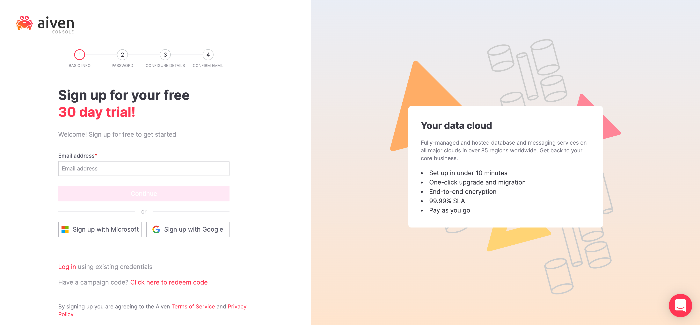

## Provisioning Apache Kafka, InfluxDB, and Grafana

In this section we'll be provisioning services Kafka, InfluxDB, and Grafana.

[Login](https://console.aiven.io/login) to Aiven's console where you'll land on the `/services` page. The `/services` page lists all services provisioned for your account. If this is your first time logging in, there should be no services provisioned at this time.

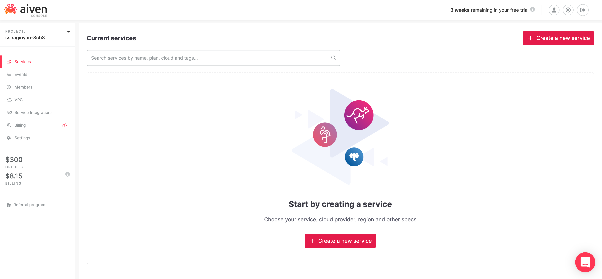

Next, we'll provision a Kafka cluster. Click on  to provision a new service. You'll be directed to the `/new-service` provisioning page shown below.

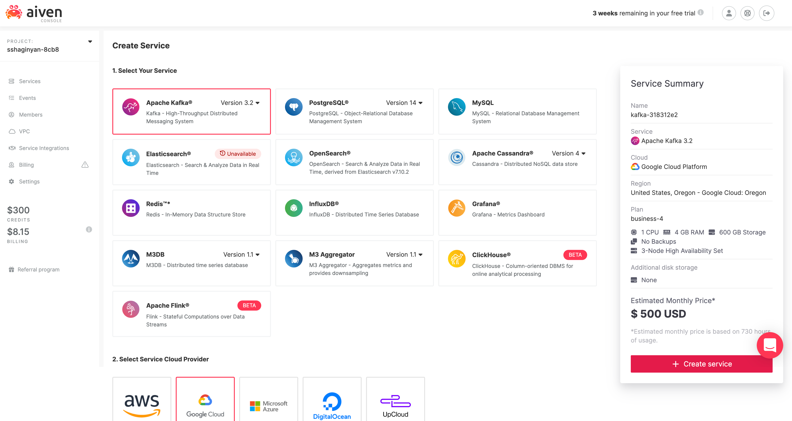

Now there is a lot happening on page! It seems overwhelming at first, but I promise it's not as complex as it seems. What our UX teams have done here is actually quite ingenious. They've clumped together complex configuration options without losing any service capabilities and provided us with merely the essentials.

- **service** e.g. Apache Kafka
- **cloud provider** e.g. Google Cloud
- **region and zone** e.g. google-us-east1
- **tier and plan** e.g. Business-4
- **service name** e.g. kafka-3d339efc
- other options that are specific to a service

Easy peasy!

Notice all services (Apache Kafka, InfluxDB, Grafana) that we'll use for this tutorial are listed on this page with Kafka selected by default. Leave all configurations as they are and click on . You'll be directed back to the `/services` page where a Kafka cluster will start provisioning.

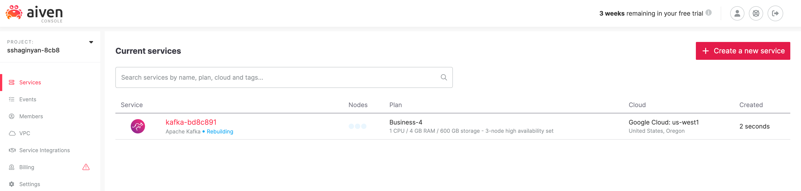

Provisioning services can take a while, therefore to paralleize efforts in the interest of time, provision Grafana and InfluxDB next in the same manner as we did Kafka. Remember, don't change any configuration options for InfluxDB or Grafana, the default configurations will be adequate for this tutorial.

Wait for provisioning to complete. The status for these services will change from "Rebuilding" in blue to "Running" in green. E.g. "InfluxDB • Running"

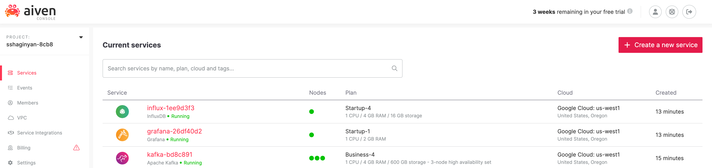 

## Publishing Messages Into Kafka

In the previous section we successfully provisioned three services: Apache Kafka, InfluxDB, and Grafana in a matter of minutes. In this section we'll be creating a Kafka topic (log of events) to hold our manufactured  financial transaction data using Aiven's console. Next, we'll create a Kafka producer using NodeJS + KafkaJS and publish messages into our topic. Finally, we'll enable Aiven's implementation of Kafka REST called Karaspace through a flip of a switch and start consuming and viewing messages within Aiven's console.

Let's get started!

#### Creating a Kafka Topic

First, let's create a brand new Kafka topic called "transactions". From the `/services` page, click on our provisioned Kafka service directing you to your Kafka's  `/overview` page. Click on the "Topics" tab and type "transactions" in the input text field under label "Topic name". Click on . You have successfully created a Kafka topic called "transactions".

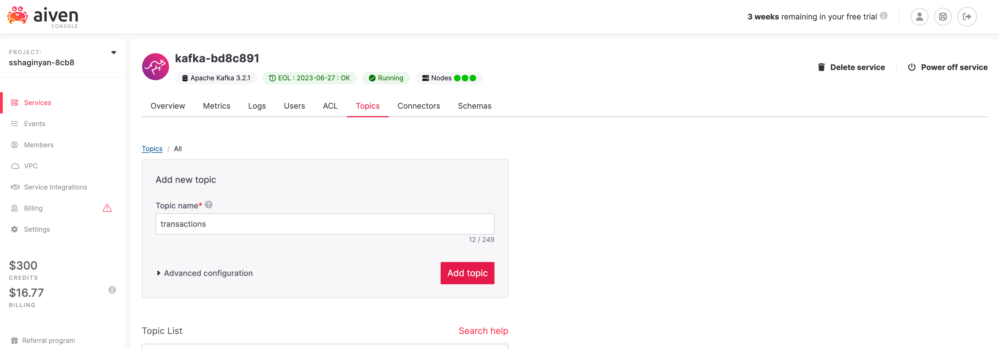

A Kafka topic is similar to a directory in a filesystem, where our Kafka messages are the files in that directory. We just created a "directory" called transactions which we'll populate with "files" that hold our fake financial transaction data.

#### Creating a Kafka Producer

Next, let's create a Kafka producer in NodeJS with client library KafkaJS. I was on the fence when deciding what language to use for this tutorial. It was either going to be Python, JavaScript via NodeJS, or Scala (since Kafka is written in Scala). I decided to use JavaScript via NodeJS to reach a broader audience according to [StackOverflows 2022 Survey](https://survey.stackoverflow.co/2022/#most-popular-technologies-language). JavaScript is still significantly popular than Python or Scala.

We'll be using three npm packages.

* **[KafkaJS](https://kafka.js.org/)** - a modern Kafka client for NodeJS.
* **[@Faker-js/Faker](https://fakerjs.dev/)** - generates category specific fake data, e.g. Finance.
* **[Dotenv](https://github.com/motdotla/dotenv#readme)** - loads environment variables from a `.env` file into [`process.env`](https://nodejs.org/docs/latest/api/process.html#process_process_env).

We'll start off by authenticating with our Kafka cluster. The default authentication method provided by our Kafka cluster is Transport Layer Security which relies on certification-based security.

Create a file called `.env` and populate it with the template below.

```bash
TOPIC="transactions"
KAFKAJS_NO_PARTITIONER_WARNING=1
SERVICE_URI="<paste here>"
ACCESS_KEY="<paste here>"
ACCESS_CERTIFICATE="<paste here>"
CA_CERTIFICATE="<paste here>"
```

Notice, the first two environment variables are already assigned and should not be changed. 

Visit the `/overview` page for our Apache Kafka service and copy () values from fields **Service URI**, **Access Key**, **Access Certificate**, and **CA Certificate** into corresponding fields in our `.env` file.

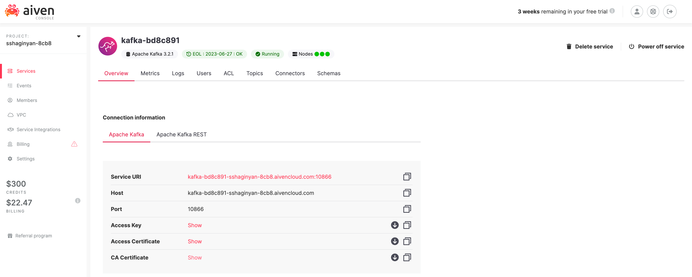

Create a new file called `producer.js` at the same directory level as our `.env` file and populate it with the code below.

```javascript
// We are importing our three npm packages
import { Kafka } from 'kafkajs';
import * as dotenv from 'dotenv';
import { faker } from '@faker-js/faker';

// Loads environment variables from .env file into process.env
dotenv.config();

// Creates an authenticated Kafka client
const kafka = new Kafka({
	brokers: [process.env.SERVICE_URI],
  ssl: {
		ca: [process.env.CA_CERTIFICATE],
		key: process.env.ACCESS_KEY,
		cert: process.env.ACCESS_CERTIFICATE
  }
});

// Creates and connects a producer to our Kafka cluster
const producer = kafka.producer();
await producer.connect();
// Creates a continuous stream of data
while(true) {

	const message = {
		key: `"${faker.datatype.uuid()}"`,
		value: JSON.stringify({
	  	// Using faker to manufacture financial transactions data
	    timestamp: faker.date.recent(),
	    account: faker.finance.account(),
	    accountName: faker.finance.accountName(),
	    currency: faker.finance.currencyCode(),
	    card: faker.finance.creditCardIssuer(),
	    amount: faker.finance.amount()
		})
  };

  // Log our message before publishing to Kafka
  console.log(message);
    
  // Publishes messages to Kafka on a particular topic
  await producer.send({ topic: process.env.TOPIC, messages: [message] });
}

// Catches any uncaught exceptions and disconnect our producer
process.on('uncaughtException', async error => {
	console.error(error, 'Uncaught Exception thrown');
	await producer.disconnect();
	process.exit(1);
});
```

Make sure you go through the code and read the comments thoroughly. Also if you just want to clone this project you can do so from https://github.com/sshaginyan/Aiven-Quickstart-With-NodeJS.

Now let's run our code. Leave this application running throughout the duration of this tutorial.

```bash
node producer.js
```

The producer code should theoretically start publishing messages into Kafka, but how do we know that's happening for sure? In the next section we'll use the Aiven console to consume and view messages from Kafka.

#### Viewing Kafka Messages in the Aiven Console

At this point our producer has theoretically started publishing messages into our Kafka Cluster. We need to verify this. Thankfully the Aiven console has a built in message consumer and viewer, but is off by default. 

Let's enable it!

Make sure you're on the Overview tab and scroll down untill the Apache Kafka REST API (Karapace) section is visable. Flip on the switch next to it.

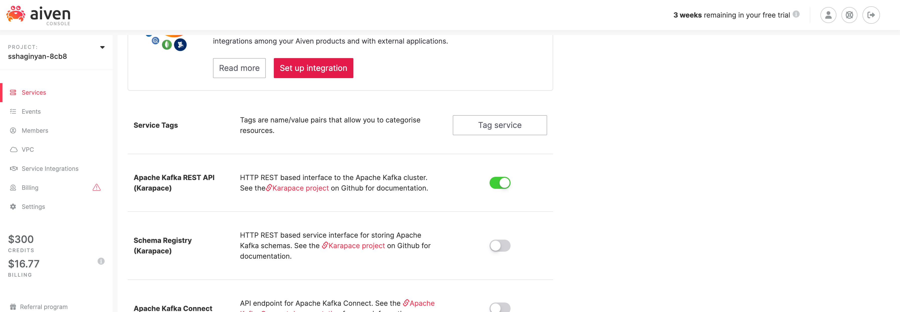

The purpose of enabling the Apache Kafka REST APIs is so that we can later consume and spot check messages from Kafka using Avien's console instead of creating a Kafka consumer from scratch. Aiven provides us with shortcuts whenever possible.

Let's view some messages!

Within the Topics tab, click on the topic "transactions" that we had created previously. A "Topic info" modal should appear like so.

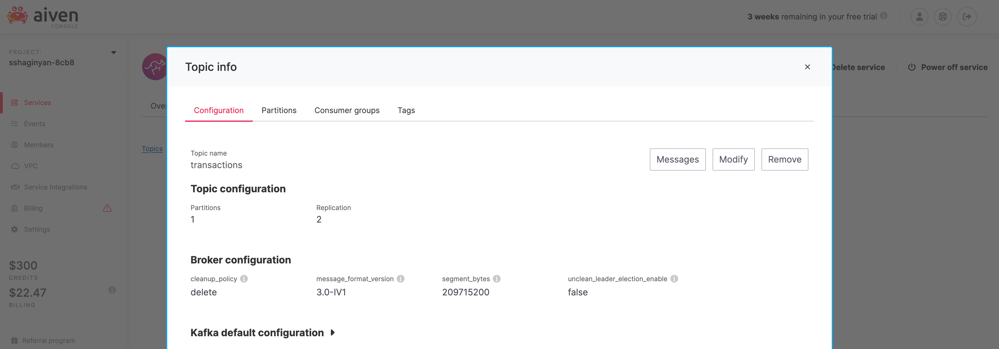

Click on  to get directed to Aiven's Kafka message viewing page. On this page you'll see option "format: binary". Change it to "format: json" and click . You'll see your messages come through.

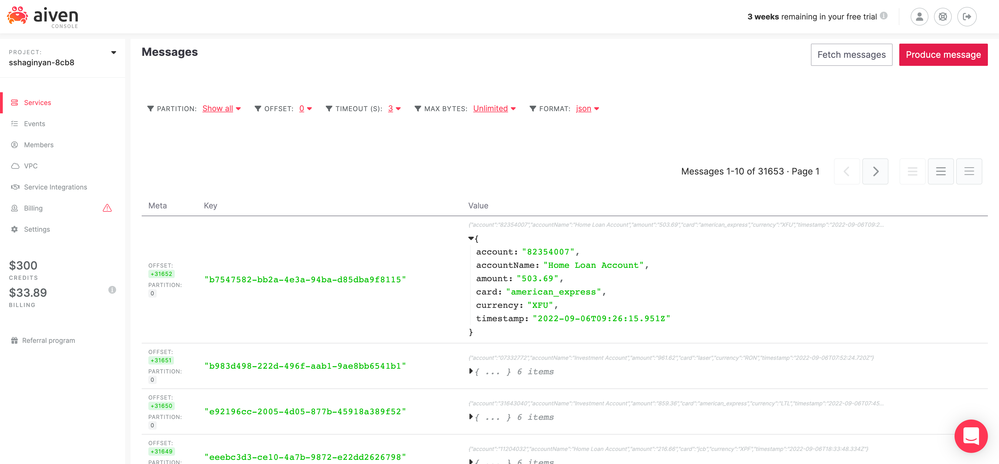

## Observability and Monitoring

In the previous section we created a Kafka producer using NodeJS and verified that indeed messages were published to our Kafka cluster. But as technologists, our work is never complete without installing proper instrumentation for measuring the health of our deployed applications and services. Therefore, in this section we'll use Aiven's Service Integrations to collect health telemetry from our Kafka clusters into InfluxDB and visualize it through Grafana.

Let's do this thing!

#### Setup Service Integrations

From the `/services` page, click on our Kafka service which will direct you to our Kafka's `overview` tab. Within the overview tab, scroll down until the Service Integrations section is visable.

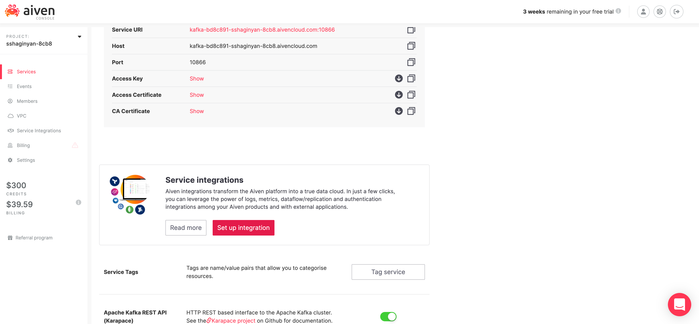

Click on . A service integrations modal will appear for my Kafka cluster instance.

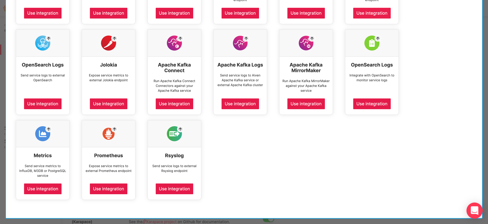

Find the "Metrics" card and click on  below it. Another modal will appear.

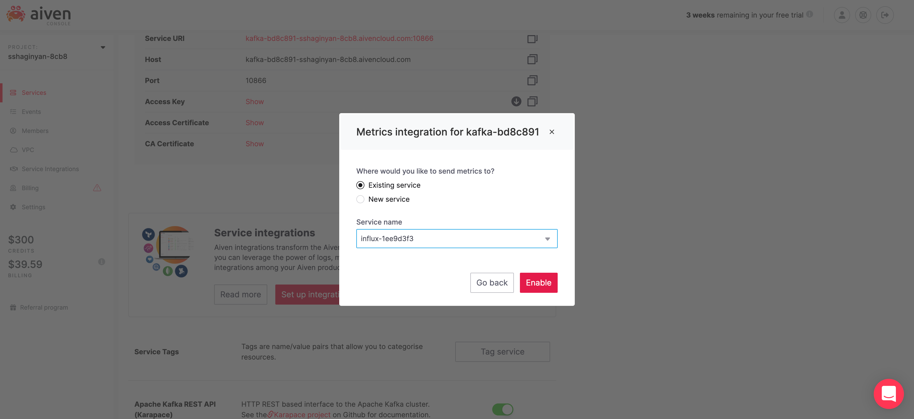

Make sure Existing service is selected and Service name starts with "influx-". Click on .

We've just set up an Aiven service integration that pulls service metrics from Kafka into InfluxDB.

Next, let's integrate Grafana with InfluxDB to visualize our Kafka service metrics.

From the `/services` page, click on our Grafana service which will direct you to Grafana's `overview` tab. Within the overview tab, scroll down until the Service Integrations section is visable.

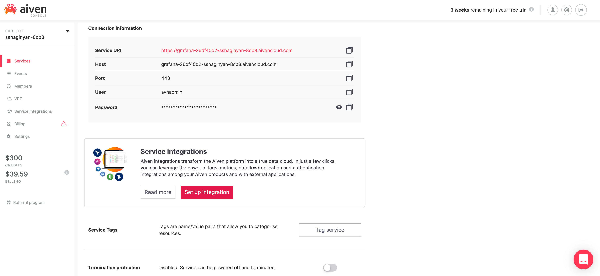

Click on . A service integrations modal will appear for my Grafana instance.

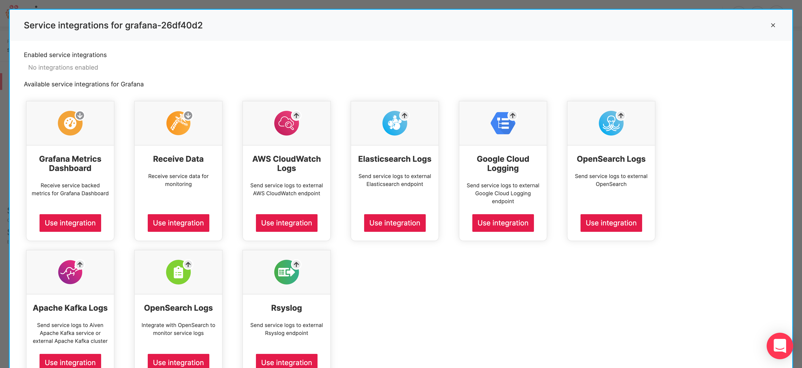

Find the "Grafana Metrics Dashboard" card and click on  below it. Another modal will appear.

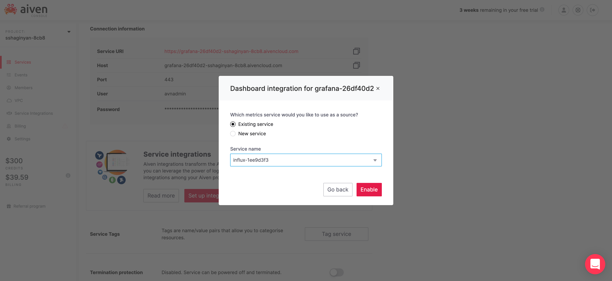

Make sure Existing service is selected and Service name starts with "influx-". Click on .

Now, we're fully integrated Kafka => InfluxDB => Grafana.

#### Viewing Metrics in Grafana

From the `/services` page, click on our Grafana service which will direct you to our Grafana's `overview` tab. 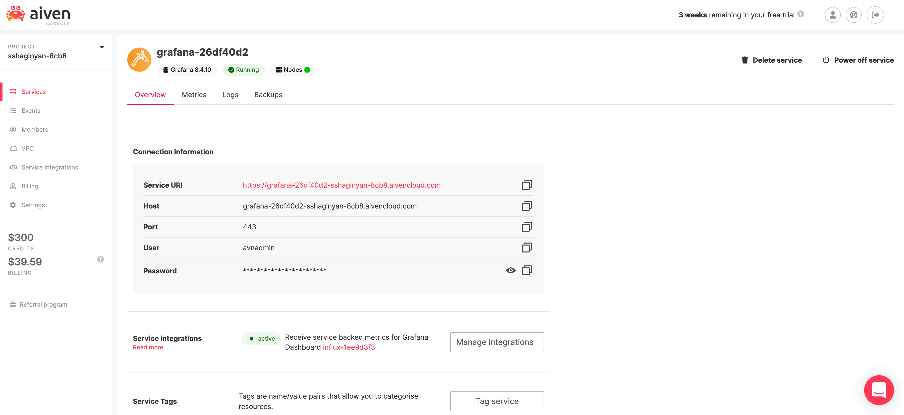

Take note of your username and password and click on Service URI which will direct you to your Grafana's login page. Login and hover over icon () to reveal a list of options on the right. Click on "Browse", then on "Aiven Kafka - kafka-bd8c891 - Resources" and you'll see dashboard chock-full of health metrics for your Kafka instance.

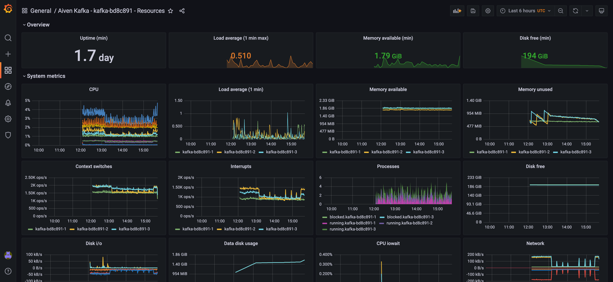

We've finally crossed the finish line! We are done! Finito!

We launched three live production quality services Kafka, InfluxDB, and Grafana within a matter of minutes.  We created a Kafka producer in NodeJS that published manufactured financial transations to our Kafka cluster. We were able to view Kafka messages from Aiven's console without writing a single line of code. Finally we were cable to connect all three services through point and click and vew health metrics for our Kafka instance.

I hope you had fun with this tutorial. I sure did :-).

Till next time. Have a good day.